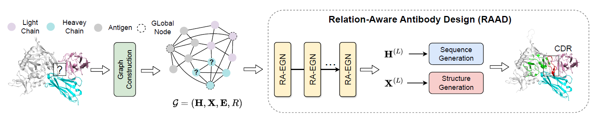

# RAAD
**Relation-Aware Equivariant Graph Networks for Epitope-Unknown Antibody Design and Specificity Optimization**

Lirong Wu, Haitao Lin, Yufei Huang, Zhangyang Gao, Cheng Tan, Yunfan Liu, Tailin Wu, Stan Z. Li. In [AAAI](https://openreview.net/forum?id=g22j55xLz2), 2025.

<p align="center">
  
</p>


## Dependencies

The script for environment setup is available in `scripts/setup.sh`, please install the dependencies before running code.

```
bash scripts/setup.sh
```


## Dataset

| Dataset                                                      | Download Script                                              |
| ------------------------------------------------------------ | ------------------------------------------------------------ |
| [SAbDab](https://opig.stats.ox.ac.uk/webapps/sabdab-sabpred/sabdab/) | [`scripts/prepare_data_kfold.sh`](./scripts/prepare_data_kfold.sh) |
| [RAbD](https://pmc.ncbi.nlm.nih.gov/articles/PMC5942852/)    | [`scripts/prepare_data_rabd.sh`](./scripts/prepare_data_rabd.sh) |
| [SKEMPI v2](https://life.bsc.es/pid/skempi2)                 | [`scripts/prepare_data_skempi.sh`](./scripts/prepare_data_skempi.sh) |

We have provided the summary data used in our paper from SAbDab, RAbD, SKEMPI_V2 in the summaries folder, and you can use the above scripts to download the required data. The processed data can be downloaded from [Google Drive](https://drive.google.com/file/d/1jYNOv_5N0-4RLRBbGTDzyrKsOo7vBNhH/view?usp=drive_link). After downloading `data for RAAD.zip`, unzip it and replace the summaries folder with the processed datasets.


## Usage

### K-fold training & evaluation on SAbDab

```
python -B train.py --cdr_type 1 --optimization 0
```

where `cdr_type` denotes the type of CDR on the heavy chain. 

The customized hyperparameters can be searched in the space provided by `. /configs/search_space.json`.


### Antigen-binding CDR-H3 Design

```
python -B train.py --optimization 1
```

The customized hyperparameters can be searched in the space provided by `. /configs/search_space.json`.


### Affinity Optimization

```
python -B train.py --optimization 2
```

The customized hyperparameters can be searched in the space provided by `. /configs/search_space.json`.


## Citation

If you are interested in our repository and our paper, please cite the following paper:

```
@inproceedings{wu2025relation,
  title={Relation-aware equivariant graph networks for epitope-unknown antibody design and specificity optimization},
  author={Wu, Lirong and Lin, Haitao and Huang, Yufei and Gao, Zhangyang and Tan, Cheng and Liu, Yunfan and Wu, Tailin and Li, Stan Z},
  booktitle={Proceedings of the AAAI Conference on Artificial Intelligence},
  volume={39},
  number={1},
  pages={895--904},
  year={2025}
}
```


## CHIMERA-Bench Integration

The following files were added for CHIMERA-Bench evaluation. Original RAAD source code in `code/` is unmodified.

### Added Files

| File | Purpose |
|------|---------|
| `config.yaml` | RAAD hyperparameters for CHIMERA training (model, training, callbacks, wandb) |
| `preprocess.py` | Converts CHIMERA dataset to RAAD's native format (PDB -> AAComplex -> pkl) |
| `chimera_trainer.py` | Training/validation/test with CHIMERA metrics (AAR, RMSD, TM-score, PPL, liabilities) |
| `chimera_evaluate.py` | Full CHIMERA evaluation (14 metrics) with bootstrap CIs, CSV output |
| `chimera_train.sh` | Automates training across CDR types and splits, then evaluates |

### Key Design Decisions

- **One CDR per run**: RAAD generates one CDR at a time (H1, H2, or H3). Run the trainer 3 times with `--cdr_type 1/2/3`.
- **Index-based complex_id mapping**: RAAD's `AAComplex.get_id()` returns PDB IDs (e.g., `3bsz`), but CHIMERA uses complex_ids (e.g., `3bsz_N_M_E`). Multiple complexes can share a PDB ID, so `preprocess.py` generates `idx_to_cid.json` (ordered list mapping dataset index to complex_id) and `complex_ids.json` (inverse lookup).
- **Paths from shared config**: All paths (data_root, results, trans_baselines) come from `baselines/shared_config.yaml`. No hardcoded paths in scripts.
- **Robust preprocessing**: PDBs that fail parsing (missing CDRs, non-standard residues) are skipped with a log message rather than crashing.

### Usage

```bash
cd baselines/raad

# 1. Preprocess (once)
python preprocess.py

# 2. Train (one CDR at a time)
python chimera_trainer.py                          # CDR-H3, epitope_group split (default)
python chimera_trainer.py --cdr_type 1             # CDR-H1
python chimera_trainer.py --cdr_type 2             # CDR-H2
python chimera_trainer.py --split temporal --wandb  # different split, with wandb

# 3. Evaluate
python chimera_evaluate.py --predictions /path/to/predictions/  # single CDR
python chimera_evaluate.py --aggregate --split epitope_group    # all CDRs
```

### Metrics Computed

**During training** (val/test, Tier 1): PPL, AAR, RMSD, TM-score, liability count.

**`chimera_evaluate.py`** (Tier 2, post-training): Full 14-metric suite -- AAR, CAAR, PPL, RMSD, TM-score, Fnat, iRMSD, DockQ, epitope precision/recall/F1, liability count, CHIMERA-S, CHIMERA-B. Uses saved `.pt` predictions + native `complex_features/*.pt` data.

### Changelog

- 2026-02-05: Added chimera_train.sh; chimera_evaluate.py now computes full 14-metric suite
- 2026-02-04: Initial CHIMERA integration (preprocess, trainer, evaluator, config)

---

## Feedback

If you have any issue about this work, please feel free to contact me by email: 
* Lirong Wu: wulirong@westlake.edu.cn


## Others

Many thanks for the code provided below

* MEAN: https://github.com/THUNLP-MT/MEAN/
* GeoAB: https://github.com/EDAPINENUT/GeoAB
