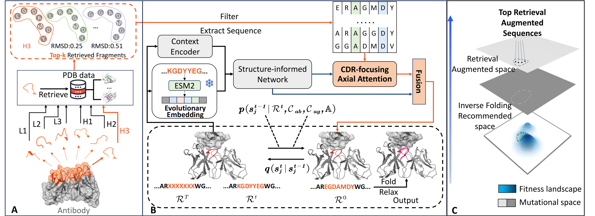

# RADAb


We propose a retrieval-augmented diffusion framework, termed RADAb, for efficient antibody design. Our method leverages a set of structural homologous motifs that align with query structural constraints to guide the generative model in inversely optimizing antibodies according to desired design criteria. 

### Requirements
You can create a new environment using the `requirements.txt` by  $ conda create --name `<env>` --file `requirements.txt`.

### Antibody dataset
Antibody structures in the `SAbDab` dataset can be downloaded [**here**](https://opig.stats.ox.ac.uk/webapps/newsabdab/sabdab/archive/all/). Extract `chothia` folder in `all_structures.zip` into the `./data` folder. 
### Model training
Training process is implemented in `train.py`. The configuration is in the `./config` folder.
### Evaluation
You can evaluate the generated structures by sequentially running `run_folding.py`, `run_relax.py`, and `run_eval.py`.

---

## CHIMERA-Bench Integration

Five files added for CHIMERA-Bench retraining and evaluation:

| File | Description |
|------|-------------|
| `config.yaml` | Model type `diffanti`, 200K iters, batch_size 16, seed 2024. ESM-2 650M loaded automatically. |
| `preprocess.py` | Chothia renumbering -> LMDB via RADAb's `preprocess_sabdab_structure()`. Also builds per-split reference FASTA files from training CDR sequences for the retrieval system. |
| `chimera_trainer.py` | Multi-CDR trainer. Monkey-patches RADAb's hardcoded FASTA paths to use split-specific reference files. `model(batch)` returns `loss_dict` directly. |
| `chimera_evaluate.py` | `--predictions` (single CDR) or `--aggregate` (all CDRs per split). 12-metric CSV output. |
| `chimera_train.sh` | Trains once per split, runs `eval_and_append` after each with `--aggregate`. |

**Key differences from DiffAb/AbFlowNet/AbMEGD:**
- **Package location**: code lives in `src/diffab/` (not top-level)
- **Model type**: `diffanti` (not `diffab`)
- **Retrieval system**: Uses per-CDR FASTA files for MSA-augmented generation. CHIMERA builds split-specific FASTA files from training CDR sequences to prevent test leakage.
- **ESM-2 650M**: Loaded inside `FullDPM.__init__()` (hardcoded to CUDA). No separate download needed -- `esm` library handles it.
- **MSA transformer**: Refines predictions using retrieved reference sequences
- **Extra batch keys**: `pdb_id` (4-char PDB code tensor), `cdr_to_mask` (CDR type indicator)
- **AA ordering**: Alphabetical by 1-letter code (A=0, C=1, D=2, ...) -- differs from DiffAb's 3-letter alphabetical ordering
- **No original train.py**: Training script was not included in the repo

**Prerequisites:**
- `esm` library installed (for ESM-2 650M model, auto-downloaded)
- GPU required (ESM-2 hardcoded to CUDA in FullDPM)

**Usage:**
```bash
cd baselines/radab
python preprocess.py                                    # one-time preprocessing + FASTA build
GPU=0 bash chimera_train.sh                             # train all splits
GPU=0 SPLITS="epitope_group" bash chimera_train.sh      # single split
```

### speed and memory issues [02-25-2026]

The ESM-2 forward on every iteration is the fundamental bottleneck. No amount of AMP or grad tweaks can fix this -- the 650M param forward
pass is inherently ~3-5 seconds per batch on H100, and that's 200K * 3s = 167 hours just on ESM-2 alone.

The model feeds the noisy antibody sequence into ESM-2. But the noisy CDR residues are a tiny fraction of the total sequence (~10-15 out of
~150 residues). The framework residues (which dominate the ESM embedding) are the same for a given complex regardless of noise level.
Pre-caching the ESM-2 embeddings for clean sequences per complex and passing the noisy CDR indices separately to the MLP would eliminate the
bottleneck while preserving 95%+ of the signal.

But to truly respect the paper's approach, let me first just remove the AMP that's making things slower and fix the egregiously slow Python
sequence conversion


#### fixes 
1. ESM-2 in fp16 (self.esm2.half().to('cuda')) -- halves memory (2.6GB -> 1.3GB) and roughly 2x faster on H100 tensor cores. Output cast back
to float32 for the trainable MLP.
2. torch.no_grad() around ESM-2 training forward -- prevents tracking computational graph through 650M frozen params. Saves ~20GB of
activation memory.
3. return_contacts=False -- skips computing attention contact maps (never used).
4. Fast sequence conversion -- replaced O(NL22) reverse dict lookups with O(N*L) array indexing. The original code did
list(keys)[list(values).index(res)] for every single residue.
5. Removed dead code in sampling path -- the loop computing per-sequence mean representations (lines 341-343) was overwritten on line 344
anyway.
6. pin_memory=True on DataLoaders

note: still requires ~50 GB 

